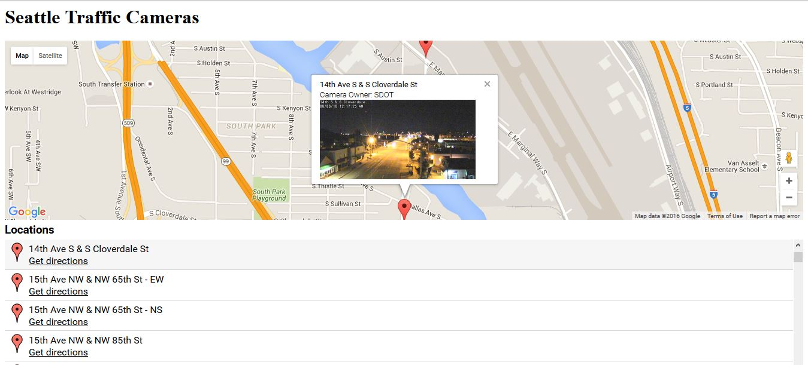

# socrata-googlemaps.js (v1.0)

This library allows developers to embed google map with a simple interface to view features directly from Socrata tables https://www.socrata.com.

__Note that the Socrata table being used must have a location field in order for this library to work or a latitude/longitude columns.__




# Getting Started

1. Add js and css to your site:

    ```html
    <!-- needed with the library -->
    <script src="https://code.jquery.com/jquery-1.12.3.min.js" integrity="sha256-aaODHAgvwQW1bFOGXMeX+pC4PZIPsvn2h1sArYOhgXQ=" crossorigin="anonymous"></script>
    <script src='https://maps.googleapis.com/maps/api/js?sensor=true'></script>

    <link rel="stylesheet" href="./resources/css/socrata-googlemaps.css" />
    <script src="./resources/js/socrata-googlemaps.js"></script>
    ```

2. Create the map and load the data

    ```javascript
    sgm = new SocrataGoogleMaps({
                baseUrl: 'https://soda.demo.socrata.com',
                table: '6yvf-kk3n',
                formatData: false,
				zoom: 2,
				latitude: 'location.coordinates[1]',
                longitude: 'location.coordinates[0]',
				center: {
					lat: 26.273714,
					lng: -3.339844
				},
                enableDirections: false,
                tplInfowindow: '<b>Earthquake Id: </b><br> Region: <br> Depth: <br>  Magnitude: <br>  Source:  ', 
                tplDirections: ', ',
                tplListing: '<br> Depth: &nbsp; Magnitude: <br>'
            }).render('sgm').load({
                $order: 'region'
            }, function(el) {
                console.log("done", sgm.getRecords().length);
            });
        });

    ```

# Stylesheet

The stylesheet can be easily modified to add needed changes.  The namespace is .sgm-... see the resources/css/socrata-googlemaps.css for more details on classes. 

# Properties

* __baseUrl__ (required) - This is the url to the Socrata server. ie. https://soda.demo.socrata.com
* __table__ (required) - This is the 4x4 socrata table id.
* __tplInfowindow__ - You will need to define your tpl that you will want to see when you click on a marker on the map.  The text here will be rendered inside the popup info window. See Template Engine below for details on how to use define this value.
* __enableListings__ - This flag is used to render the listings portion of the component. Defaults to true.
* __enalbleDirections__ - This flag is used to render the directions routing feature of the component. Defaults to true. 
* __center__ - Object of lat/lng that will be the starting point of the map.  Defaults to: { lat: 39.4, lng: -104.9 }
* __zoom__ - The zoom level the map will start on. Defaults to 10.
* __clickZoom__ - Zoom level the map will zoom too when the icon or row is selected. Defaults to 15.

* __tplListing__ - It will define the data format in the listing section. See Template Engine below for details on how to use define this value.
* __tplDirections__ - You will need to define your tpl, to show the data format to be used in the Source/Destination address to get direction. See Template Engine below for details on how to use define this value.
* __formatData__ - If the database contains any data to be parsed then "formatData" is used. 

# Methods

* __constructor( { properties } )__ - Returns pointer to the instance.
* __render( divId )__ - This is the ```html <div id="sgm" class="sgm"></div>``` tag that would be use to render the component.
* __load( options, callback )__ - This will make a request to the Socrata table and load the information.
* __getRecords()__ - Returns the records that where returned from the Socrata table

# Events

* __load__ - Event on the map load. Returns the filtered data set used in the map.
* __locationSelected__ - Event on selecting a location. Returns the selected location data and list of all the locations.


# Demos

* [Seattle Traffic Cameras](https://htmlpreview.github.io/?https://github.com/mikegiddens/socrata-GoogleMaps/blob/master/examples/SeattleTrafficCameras.html)
* [Address] (https://htmlpreview.github.io/?https://github.com/mikegiddens/socrata-GoogleMaps/blob/master/examples/address.html)
* [Earthquakes] (https://htmlpreview.github.io/?https://github.com/mikegiddens/socrata-GoogleMaps/blob/master/examples/earthquakes.html)

---------------------------------------

# Template Engine

This library makes use of the "JavaScript-Templates" engine https://github.com/blueimp/JavaScript-Templates

# License MIT
